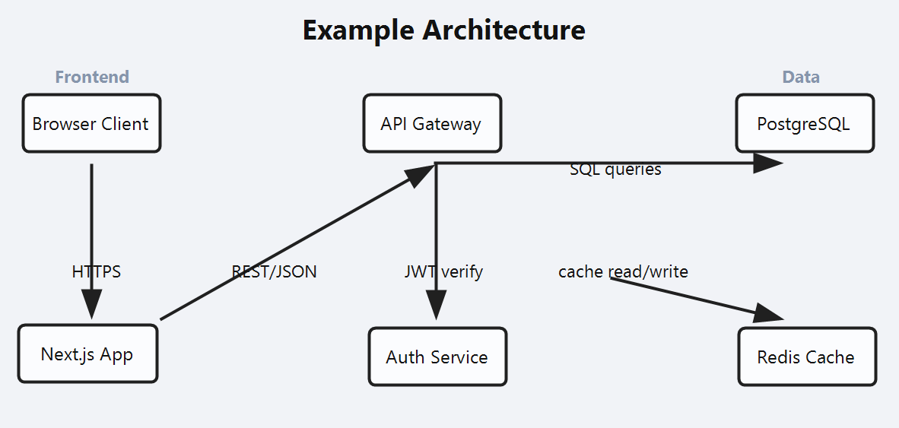

# claude-code-skill-tldraw-diagram

A [Claude Code](https://docs.anthropic.com/en/docs/claude-code) skill that generates VS Code-compatible tldraw (`.tldr`) architecture diagrams from JSON.

## Why

When you work on a project inside Claude Code for a long time, it's easy to lose track of the overall architecture and workflow. This skill lets you **instantly visualize your project structure** as an interactive diagram — right inside VS Code, for free, with zero setup.

Just describe your architecture as simple JSON (`nodes` + `edges`), and the skill generates a `.tldr` file that opens natively in VS Code via the tldraw extension. No external tools, no browser tabs, no paid services.

## Preview

Example diagram rendered in VS Code tldraw:



## Prerequisites

### 1. tldraw VS Code Extension (required)

Install the **tldraw** extension to view `.tldr` files directly in VS Code:

```bash
code --install-extension tldraw-org.tldraw-vscode
```

Or manually: Extensions (`Ctrl+Shift+X`) → search "tldraw" → Install [tldraw by tldraw](https://marketplace.visualstudio.com/items?itemName=tldraw-org.tldraw-vscode)

Without this extension, `.tldr` files will open as raw JSON.

### 2. Node.js >= 18

The generator script uses only built-in Node.js modules (`fs`, `path`) — zero npm dependencies.

## Installation

### Step 1: Install the Skill for Claude Code

Claude Code discovers skills from `~/.claude/skills/`.
Copy `SKILL.md` and the bootstrap dependencies:

```bash
git clone https://github.com/MOZARTINOS/claude-code-skill-tldraw-diagram.git
mkdir -p ~/.claude/skills/tldraw-json-to-tldr
cp claude-code-skill-tldraw-diagram/SKILL.md ~/.claude/skills/tldraw-json-to-tldr/
cp -r claude-code-skill-tldraw-diagram/scripts ~/.claude/skills/tldraw-json-to-tldr/
cp -r claude-code-skill-tldraw-diagram/assets ~/.claude/skills/tldraw-json-to-tldr/
cp -r claude-code-skill-tldraw-diagram/examples ~/.claude/skills/tldraw-json-to-tldr/
```

### Step 2: Add the Generator to Your Project

Copy the `scripts/` directory into your project so Claude can find and run it:

```bash
cp -r claude-code-skill-tldraw-diagram/scripts your-project/scripts
```

Or keep the entire repo as a subdirectory:

```bash
cp -r claude-code-skill-tldraw-diagram your-project/skills/tldraw-json-to-tldr
```

### Standalone Usage (no Claude Code)

```bash
git clone https://github.com/MOZARTINOS/claude-code-skill-tldraw-diagram.git
cd claude-code-skill-tldraw-diagram
node scripts/gen-tldr.mjs --in examples/diagram.json --out examples/diagram.tldr
```

### One-command project bootstrap

Use this when opening a new or old project where diagram generation is not configured yet:

```bash
# From this skill repository:
node scripts/bootstrap-project.mjs --target /path/to/your-project

# If the skill is already inside your project:
node skills/tldraw-json-to-tldr/scripts/bootstrap-project.mjs --target .

# If the skill is installed globally:
# Bash/Zsh:
node "$HOME/.claude/skills/tldraw-json-to-tldr/scripts/bootstrap-project.mjs" --target /path/to/your-project
# PowerShell:
node "$env:USERPROFILE/.claude/skills/tldraw-json-to-tldr/scripts/bootstrap-project.mjs" --target .
```

Bootstrap will:
- install/update `scripts/gen-tldr.mjs`
- create `.diagrams/` files if missing
- add VS Code tasks and extension recommendation
- generate and validate `.diagrams/smoke-test.tldr` and `.diagrams/diagram.tldr`

### One-command doctor (bootstrap + VS Code cache reset)

Use this when you still get a blank tldraw canvas in a specific project:

```bash
# PowerShell
node "$env:USERPROFILE/.claude/skills/tldraw-json-to-tldr/scripts/doctor-vscode-tldraw.mjs" --target . --reset-workspace-cache

# Bash/Zsh
node "$HOME/.claude/skills/tldraw-json-to-tldr/scripts/doctor-vscode-tldraw.mjs" --target . --reset-workspace-cache
```

If needed, run hard reset:

```bash
node "$env:USERPROFILE/.claude/skills/tldraw-json-to-tldr/scripts/doctor-vscode-tldraw.mjs" --target . --hard-reset-workspace
```

## Input Format

Create a JSON file with this structure:

```json
{
  "title": "My Architecture",
  "nodes": [
    { "id": "client", "label": "Browser Client", "group": "Frontend" },
    { "id": "api", "label": "API Server", "group": "Backend" },
    { "id": "db", "label": "PostgreSQL", "group": "Data" }
  ],
  "edges": [
    { "from": "client", "to": "api", "label": "REST" },
    { "from": "api", "to": "db", "label": "SQL" }
  ]
}
```

| Field | Type | Description |
|-------|------|-------------|
| `title` | `string` | Diagram title displayed at the top |
| `nodes[].id` | `string` | Unique node identifier |
| `nodes[].label` | `string` | Display text inside the node |
| `nodes[].group` | `string` | Column grouping (nodes in the same group appear in the same column) |
| `edges[].from` | `string` | Source node `id` |
| `edges[].to` | `string` | Target node `id` |
| `edges[].label` | `string` | Arrow label text |

## Usage

### Generate a `.tldr` from diagram JSON

```bash
node scripts/gen-tldr.mjs --in path/to/diagram.json --out path/to/output.tldr
```

### Generate a smoke test file

```bash
node scripts/gen-tldr.mjs --smoke --out smoke-test.tldr
```

The smoke test creates a minimal `.tldr` with a single "SMOKE TEST" box. Use this to verify that the tldraw extension is working before debugging your diagram.

### Default paths

```bash
# Uses .diagrams/diagram.json -> .diagrams/diagram.tldr
node scripts/gen-tldr.mjs
```

### Show help

```bash
node scripts/gen-tldr.mjs --help
```

## The Problem This Solves

The tldraw VS Code extension expects `.tldr` files to follow a strict internal schema. Files generated with incorrect schema versions, missing migration sequences, or legacy property names (like `props.text` instead of `props.richText`) result in a **blank canvas** with no visible error.

This skill produces `.tldr` files that render correctly every time by enforcing:

1. **Correct schema** — `tldrawFileFormatVersion: 1`, `schemaVersion: 2`, and all required `com.tldraw.*` migration sequences
2. **Required base records** — `document:document`, `page:page`, `camera:page:page`
3. **Modern shape properties** — `props.richText` (ProseMirror format) instead of the deprecated `props.text`
4. **Valid prop sets** — only properties that pass tldraw's schema validation for `geo`, `arrow`, and `text` shapes

### Layout

Nodes are arranged in columns by `group`. Each group gets a header label. Arrows connect node centers.

## tldraw Compatibility Contract

See [references/tldraw-compat.md](references/tldraw-compat.md) for the full schema contract, including:

- Required top-level fields
- Required base records
- Shape property specifications for `geo`, `arrow`, and `text` types
- Common blank-canvas causes and recovery steps

## Troubleshooting

| Symptom | Fix |
|---------|-----|
| Blank canvas in all projects | **Open the project folder first** (`File → Open Folder`), then open the `.tldr` file. The tldraw extension requires the file to be inside the active workspace. |
| Blank canvas | Run `--smoke` first. If smoke works, regenerate from JSON |
| Smoke also blank | Run `doctor` to reset workspace cache, then reload VS Code |
| Shapes missing | Check that `diagram.json` has valid `nodes` and `edges` |
| Arrows not connecting | Verify `from`/`to` values match node `id` values |
| `.tldr` opens as raw JSON | Install the [tldraw VS Code extension](https://marketplace.visualstudio.com/items?itemName=tldraw-org.tldraw-vscode) |

## Keywords

`claude-code` `claude-code-skill` `tldraw` `tldr` `vscode` `architecture-diagram` `diagram-generator` `json-to-diagram` `code-visualization` `project-workflow`

## License

MIT
